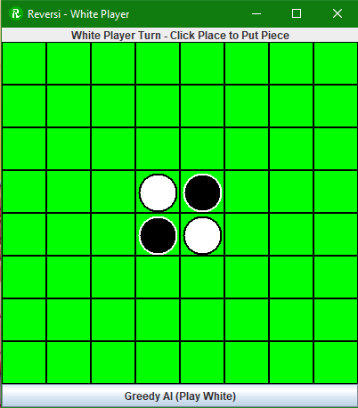
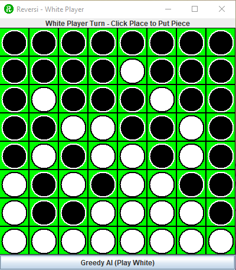

# Reversi
## Overview
A java version of the board game Reversi created using the Swing module.

- Two players take turn placing one of their pieces onto the board
- If two pieces can create a straight line then all pieces in between will become that colour
- Each play must convert at least one piece from the opposition
- The game ends when there are no more moves left

For more information on Reversi see: https://en.wikipedia.org/wiki/Reversi

- This program also contains a greedy AI that the player can use to complete their turn.
- The game will restart after the user confirms the result of the previous game
## Instructions
Left click to place your piece in a valid location

Click the AI button to let the greedy AI take your turn

You cannot play when it is not your turn

- The title at the top of the screen will tell you when it is your turn
## Screenshots

Program start:

Game Progress|Player White POV: | Player Black POV:
|------------|------------------|-------------------|
| Program Start |  | |
| Game Finish | |  |

Pop-up when game finishes:

